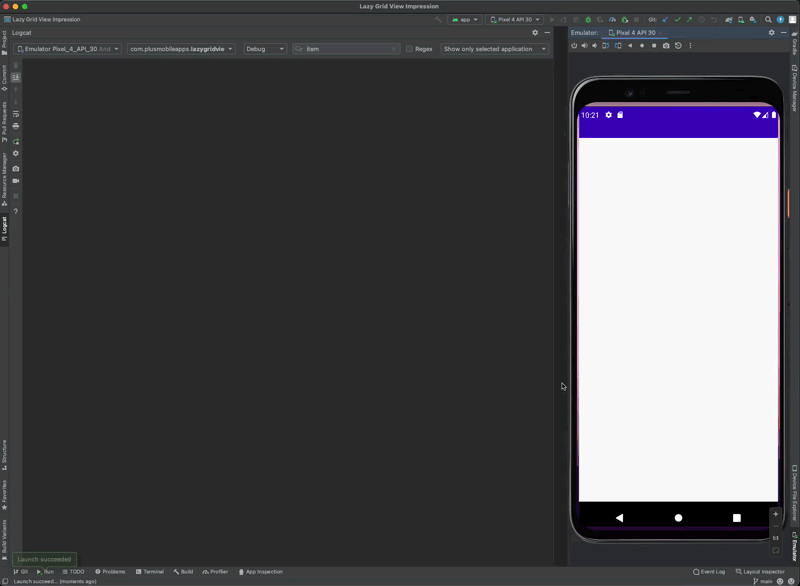

# Jetpack Compose Lazy Column Analytics

Jetpack Compose sample of tracking items viewed in a lazy column exactly once for view impression analytics. 

## Quick Links

* [blog post](https://plusmobileapps.com/2022/05/04/lazy-column-view-impressions.html) describing everything done in this project
* [MainActivity](https://github.com/plusmobileapps/lazycolumn-view-impressions/blob/main/app/src/main/java/com/plusmobileapps/lazygridviewimpression/MainActivity.kt) - all the compose related code
* [MainViewModel](https://github.com/plusmobileapps/lazycolumn-view-impressions/blob/main/app/src/main/java/com/plusmobileapps/lazygridviewimpression/MainViewModel.kt) - state management and delegated to `AnalyticsTracker` 
* [AnalyticsTracker](https://github.com/plusmobileapps/lazycolumn-view-impressions/blob/main/app/src/main/java/com/plusmobileapps/lazygridviewimpression/AnalyticsTracker.kt) - simple class for tracking view impressions exactly once per key